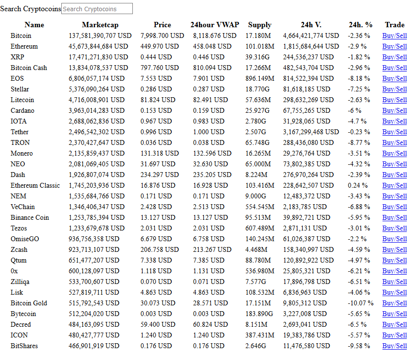

<p align="center">
   
</p>

<h1 align="center">React dApp Project | MarketInfo</h1>

<p align="center">
  This is a project for creating a <strong>dApp</strong> on the <strong>nOS</strong> platform
</p>

<p align="center">
  <a href="https://github.com/nos/create-nos-dapp/releases">
    
  </a>
  <a href='https://github.com/prettier/prettier'>
    
  </a>
</p>

<p align="center">
   
</p>


## Setup
```bash
$ cd marketinfo
$ yarn
$ yarn start
```


## Testing
Use `yarn test:local` or `npm run test:local` to run all tests locally. The `test` command is reserved for CI builds.


## Known issues
 * Build assets to dedicated subdirectory https://github.com/parcel-bundler/parcel/issues/233
